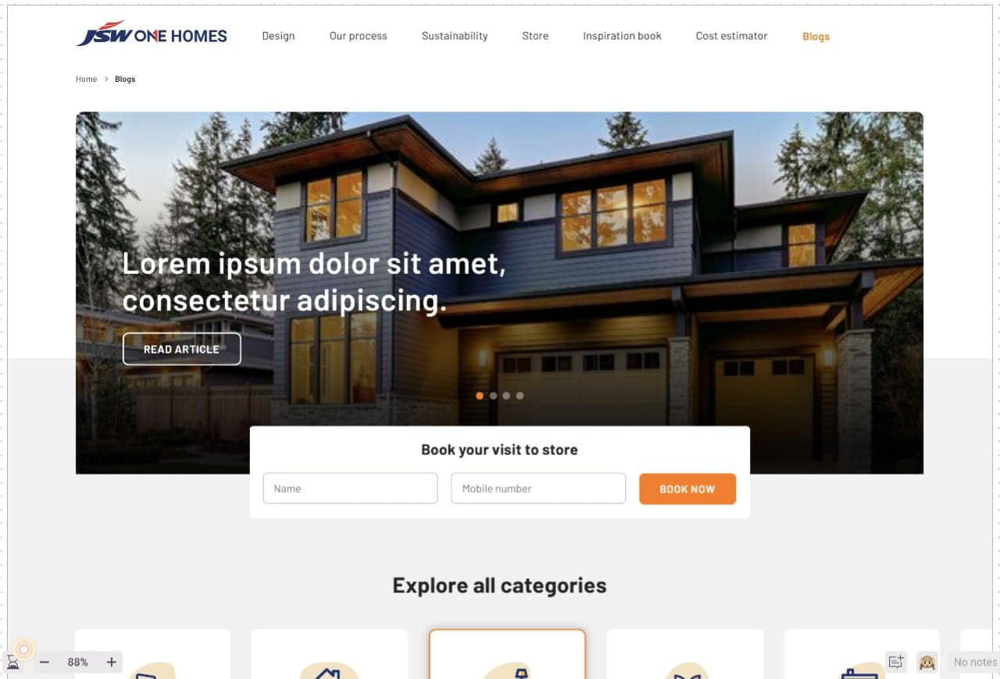
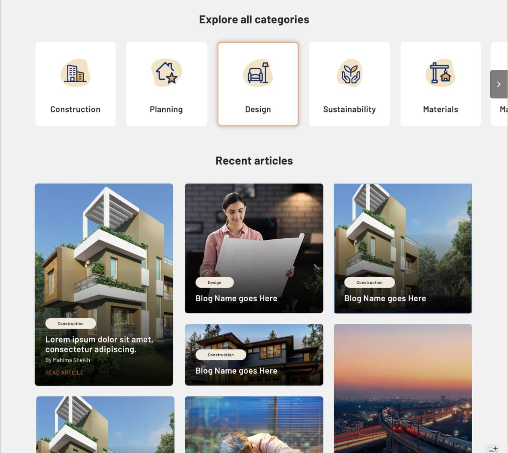
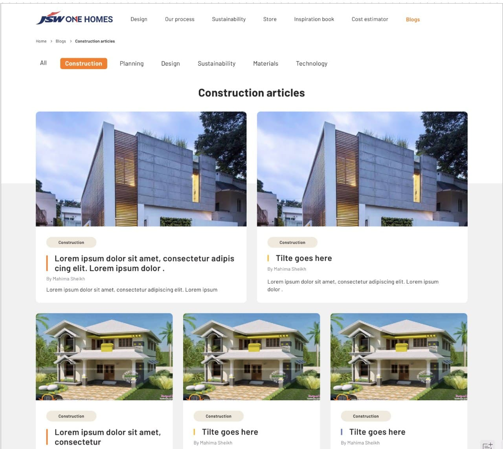
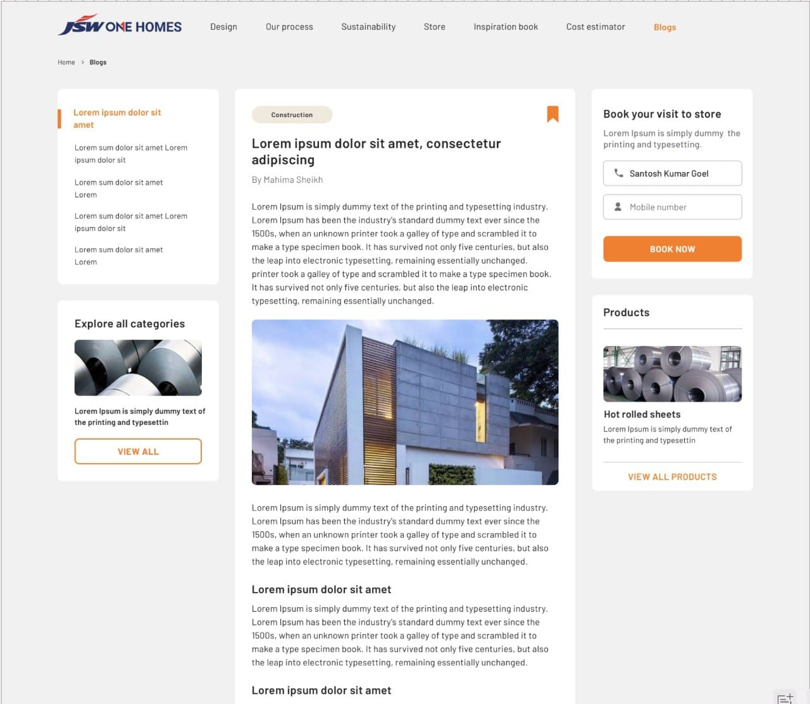

# Vuejs Tailwind App

# Demo
<a href="htpps://resido-vue.web.app">demo</a>

## Website Designs






## Project setup
```
npm install
```

### Compiles and hot-reloads for development
```
npm run serve
```

### Compiles and minifies for production
```
npm run build
```

### Lints and fixes files
```
npm run lint
```

### Customize configuration
See [Configuration Reference](https://cli.vuejs.org/config/).
